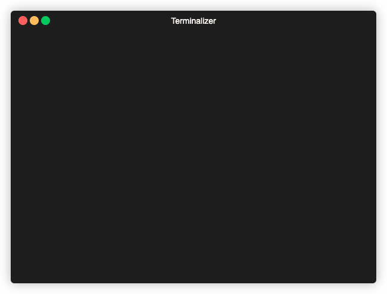
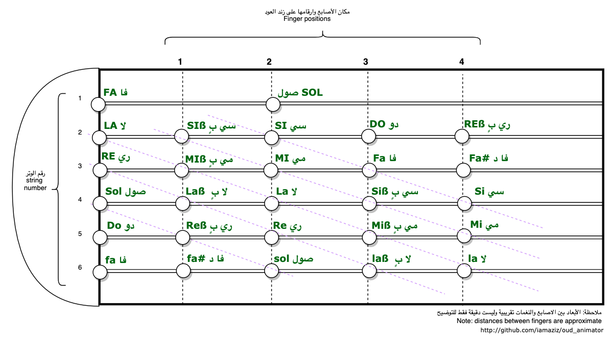
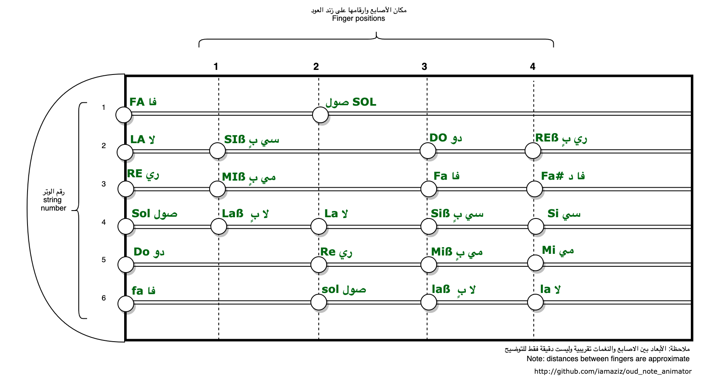

Oud Animator
============

**_UPDATE_** Now as a Streamlit App 

[![Open in Streamlit][share_badge]][share_link]

[share_badge]: https://static.streamlit.io/badges/streamlit_badge_black_white.svg
[share_link]: https://oudnote.streamlit.app

<hr>

Animate musical notes on the [Arabic Oud](https://en.wikipedia.org/wiki/Oud) strings (for fun and learning purpose).  

**Usage:**

```
$ python oud_animator.py -h
usage: oud_animator.py [-h]
                       [-note NOTE | -maqam {bayat,kurd_do} | -song {khaieef,rk_lesson5,saaloony_elnas}]
                       [-speed SPEED]

optional arguments:
  -h, --help            show this help message and exit
  -note NOTE            enter the notes to show. As space-separated string
                        (e.g. -note 'DO RE MI Fa Sol La Si Do')
  -maqam {bayat,kurd_do}
                        choose Maqam to display its notes
  -song {khaieef,rk_lesson5,saaloony_elnas}
                        choose a song from the available songs
  -speed SPEED          transition speed between notes (i.e. sleep time in
                        seconds)
```

**Demo1:**


**Demo2:**




**Oud's Zend with notes illustration:**



<!--  -->


<hr>

> Note: This animation can be used/applied to the Guitar as well. Just change note names and locations in [`NOTE_INDEX`](https://github.com/iamaziz/oud_animator/blob/master/config.py#L26-L55).
