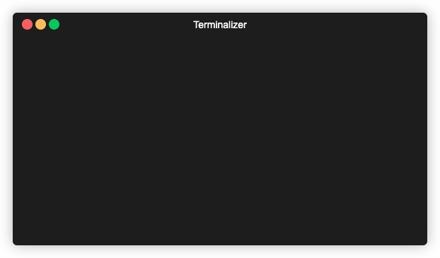

**Usage:**

```bash
$ python oud_animator.py -h
usage: oud_animator.py [-h]
                       [-note NOTE | -maqam {bayat,kurd_do} | -song {khaieef}]
                       [-speed SPEED]

optional arguments:
  -h, --help            show this help message and exit
  -note NOTE            the note sheet as space-separated string (e.g. -note
                        'DO RE MI Fa Sol La Si Do')
  -maqam {bayat,kurd_do}
                        choose Maqam to display its notes
  -song {khaieef}       choose a song
  -speed SPEED          transition speed between notes (i.e. sleep time in
                        seconds)
```

**Demo:**

<!--  -->


**Oud's Zend with notes illustration:**

<!--  -->
<!--  -->


